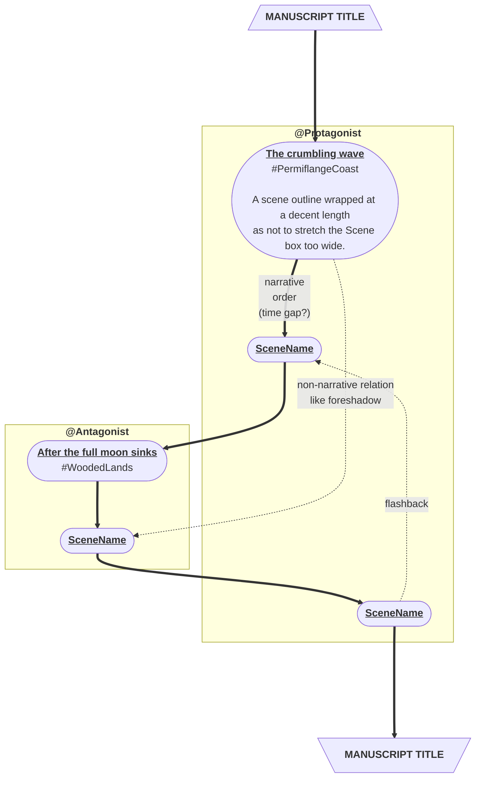

# Monkeytale

> "The book is a program." --- [Pollen](https://docs.racket-lang.org/pollen/big-picture.html) by Matthew Butterick

Monkeytale is a markup language for documenting and composing a story world and its novels. I am building it to improve insight into my own writing and to learn more about software development.

Plugins will use Monkeytale's structured writing content to generate things like Word documents for editor submissions or scene flows like this:

## Design Principles

- Derive as much as possible from the text itself before adding in syntax.
- Document what is written, let plugins report on the structure and content, and then gather the results.
- Set up and forget.

## Decisions

Monkeytale syntax lives in [Workflowy](https://workflowy.com), a multi-platform outliner. An OPML export of Workflowy content will be given to the Monkeytale parser, which in turn will pass the generated structure and content on to each installed plugin.

- Monkeytale needs to work without installing any software on the user's system other than a browser, which is assumed to be already present.
- [Workflowy](https://workflowy.com) as writing platform. Workflowy supports multi-platform, offline editing.
- [Github](https://github.com) as the store for exported OPML and the associated Monkeytale plugin outputs. Github supports multi-platform offline storage to read or backup the Monkeytale plugin output.
- [Github Actions](https://github.com/features/actions) as execution platform, so nothing will have to be installed on the user's system other than [Github Desktop](https://desktop.github.com/). There is no offline alternative to refresh the Monkeytale plugin output.
- [Github Repo Templates](https://docs.github.com/en/repositories/creating-and-managing-repositories/creating-a-template-repository) as the [quick start template](https://docs.github.com/en/repositories/creating-and-managing-repositories/creating-a-repository-from-a-template).
- [Python 3](https://www.python.org/) as the programming language for Monkeytale and any plugins that folks might want to build.

## Development

Monkeytale is developed in my spare time and uses [Semantic Versioning](https://semver.org/) and [Semantic Release](https://pypi.org/project/python-semantic-release/) to track its, equally spare, progress.

As per Semantic Versioning: "Major version zero (0.y.z) is for initial development. Anything MAY change at any time. The public API SHOULD NOT be considered stable."

Check the [change log](https://github.com/MLAOPDX/monkeytale/blob/main/CHANGELOG.md) for the latest updates.
