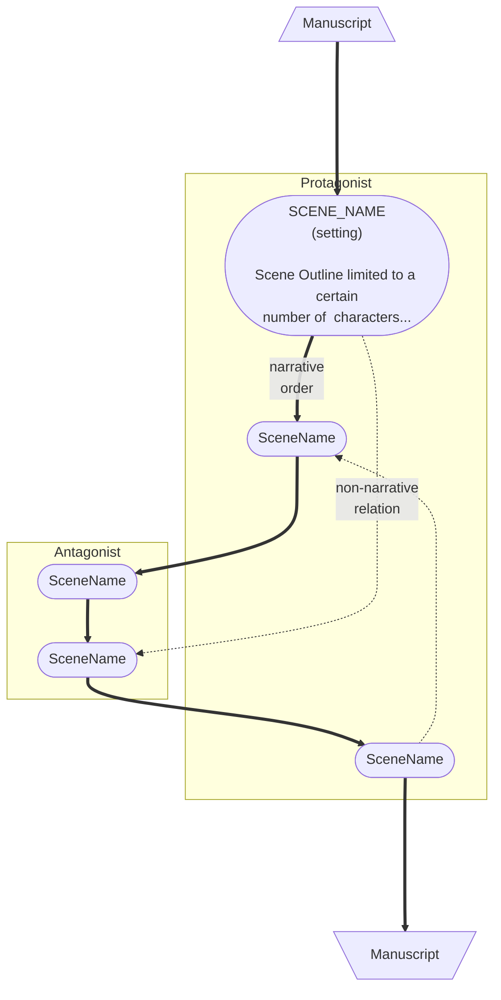

# Monkeytale

> "The book is a program." from [Pollen](https://docs.racket-lang.org/pollen/big-picture.html) by Matthew Butterick

Monkeytale is a markup language for documenting and composing a story world and its novels. I am building this language to improve insight into my own writing and to learn more about software development.

## Design Principles

To stay honest in the application of these principles, here's a useful bit to keep in mind:

> "Special cases aren't special enough to break the rules, although practicality beats purity." from [The Zen of Python](https://peps.python.org/pep-0020/) by Tim Peters

- **The book is a program.** Monkeytale lives within your manuscript, within your notes, where you work.
- **Document what is there. Plugin your view and opinion.** Monkeytale does not give advice on how to improve the writing. Its job is to collect information about the writing, so that plugins can report on the information collected. Those plugins then compose, visualize, or opine on the writing. Or do something completely different.
- **Keeping it simple makes it durable.** Monkeytale has one command structure, no configuration, and uses flat text files.

## Planned Functionality

Monkeytale functionality comes in two parts. The core functionality documents as much as possible of what has been written. The second is plugins. Plugins use the collected writing data to add value.

### Monkeytale
The core Monkeytale functionality encodes structure into your writing with a light syntax, so that plugins can render different insights and outputs.
- Compose multiple narratives by (re-)using story components
- Derive story structure from story components and their content. For example, why would you make notes on which characters participate in a scene and which characters are referenced? This is information Monkeytale can do for you with reasonable accuracy.
- Provide plugin mount point for generation of documents from story structure extracted by Monkeytale, or anything else the plugin thinks would be of value.
- Execute Monkeytale on continuous integration server.

### Plugin
Anyone can write a plugin. Monkeytale can make use of any plugin that is released on PyPI, the Python Package Index. The following plugins are intended to be created. The first three are so fundamental for any novel that they will be included with Monkeytale. All the others are intended to be independent packages.

1. **Generate Markdown of each manuscript** 
Assemble parts, chapters, and scenes of a manuscript into a single document.
2. **Generate Markdown for backstory components** 
Assemble characters, objects, settings, and concepts for the story world into a single document.
3. **Generate flow chart of scenes across PoV characters for each manuscript** 
Better explained with an example:

4. Generate ToDoTree configuration in .vscode/settings.json to help navigate story structure
5. Generate import file(s) for Aeon Timeline software to help visualize a story world

## Dismissed Functionality
- Advice on how to improve or correct the writing
- Typography and formatting, other than emphasis/thought (italics)
- Tables of content and indexing
- Goal tracking

## Design Decisions
- [Python 3](https://www.python.org/) will be the programming language for Monkeytale and the hooks for any plugins that folks might want to build
- [Github Actions](https://github.com/features/actions) using Linux as execution platform
- [Github Repo Fork](https://docs.github.com/en/get-started/quickstart/fork-a-repo) as the delivery system.
- Use .@ as the file extension to indicate Monkeytale files.
- Single global namespace

## ***My*** environment of choice
- [Visual Studio Code](https://code.visualstudio.com/) (VSCode) as the text editor
- [GruntFuggly's ToDoTree](https://marketplace.visualstudio.com/items?itemName=Gruntfuggly.todo-tree) VS-Code extension for VS Code to support navigation. Will need a plugin that keeps ToDoTree configuration up to date
- [Markdown Preview Enhanced](https://marketplace.visualstudio.com/items?itemName=shd101wyy.markdown-preview-enhanced) VS-Code extension for Markdown and Mermaid diagram display and conversion to docx using [PanDoc](https://pandoc.org/) and PDF using browser

## Development

Monkeytale is developed in my spare time and uses [Semantic Versioning](https://semver.org/) and [Semantic Release](https://pypi.org/project/python-semantic-release/) to track its, equally spare, progress.

As per Semantic Versioning: "Major version zero (0.y.z) is for initial development. Anything MAY change at any time. The public API SHOULD NOT be considered stable."

Check the [change log](https://github.com/MLAOPDX/monkeytale/blob/main/CHANGELOG.md) for the latest updates.
