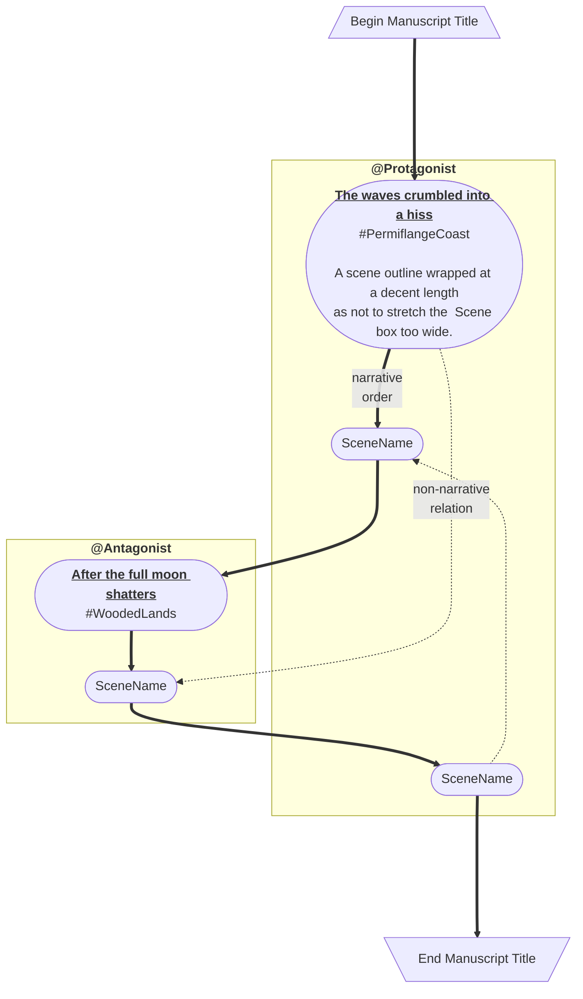

# Monkeytale

> "The book is a program." from [Pollen](https://docs.racket-lang.org/pollen/big-picture.html) by Matthew Butterick

Monkeytale is a markup language for documenting and composing a story world and its novels. I am building this language to improve insight into my own writing and to learn more about software development.

Monkeytale plugins will use the structured writing content to generate things like Word documents for editor submissions and Vellum imports. I also intend to create plugins that generate visualizations like these.

## Design Principles

- The book is a program.
- Document for others to use.
- Simplicity ensures durability.

### The Book Is A Program
Monkeytale lives where I write, in [Workflowy](https://workflowy.com), a multi-platform outliner. Monkeytale will process OPML exports of Workflowy content.

### Document for others to use.
Monkeytale only collects information about the writing, so that plugins can report on the information collected. Those plugins can compose, visualize, opine, or even rewrite your work.

### Simplicity ensures durability.
Monkeytale requires only the installation of git, has minimal configuration, and maximum extensibility. This makes changing Monkeytale functionality both more difficult and powerful.

## 
4. Generate ToDoTree configuration in .vscode/settings.json to help navigate story structure
5. Generate import file(s) for Aeon Timeline software to help visualize a story world

## Dismissed Functionality
- Advice on how to improve or correct the writing
- Typography and formatting, other than emphasis/thought (italics)
- Tables of content and indexing
- Goal tracking

## Design Decisions
- [Workflowy](https://workflowy.com) as writing platform. The content used by Monkeytale will need to meet certain structural requirements, a template of which is [shared from Workflowy](https://workflowy.com/s/world-template-dupli/3Tj4vp9gsIXYGZaT).
- [Python 3](https://www.python.org/) will be the programming language for Monkeytale and any plugins that folks might want to build
- [Github Repo](https://docs.github.com/en/repositories/creating-and-managing-repositories/creating-a-template-repository) as the [quick start template](https://docs.github.com/en/repositories/creating-and-managing-repositories/creating-a-repository-from-a-template).
- [Github Actions](https://github.com/features/actions) as execution platform, so nothing will have to be installed on the user's system other than [Github Desktop](https://desktop.github.com/).

## Development

Monkeytale is developed in my spare time and uses [Semantic Versioning](https://semver.org/) and [Semantic Release](https://pypi.org/project/python-semantic-release/) to track its, equally spare, progress.

As per Semantic Versioning: "Major version zero (0.y.z) is for initial development. Anything MAY change at any time. The public API SHOULD NOT be considered stable."

Check the [change log](https://github.com/MLAOPDX/monkeytale/blob/main/CHANGELOG.md) for the latest updates.
