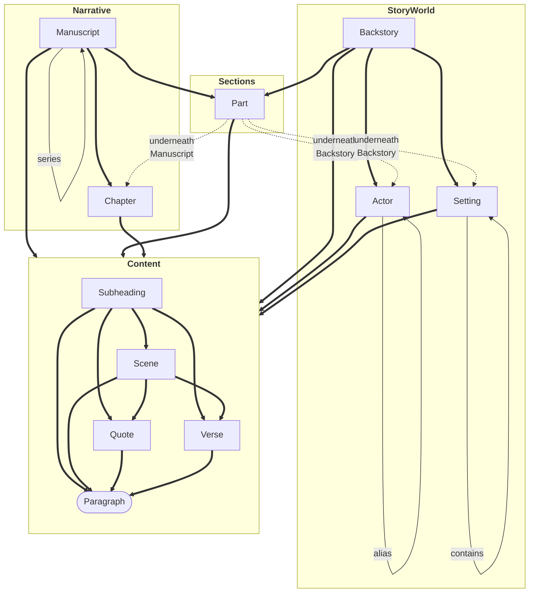

[](https://pypi.org/project/monkeytale)
[](https://github.com/MLAOPDX/monkeytale/releases)
[](https://github.com/MLAOPDX/monkeytale/blob/main/LICENSE)

[](https://github.com/MLAOPDX/monkeytale/issues)
[](https://github.com/MLAOPDX/monkeytale/pulls)
[](https://lgtm.com/projects/g/MLAOPDX/monkeytale/alerts/?mode=list)
[](https://lgtm.com/projects/g/MLAOPDX/monkeytale/context:python)

# Monkeytale

> "The book is a program." --- [Pollen](https://docs.racket-lang.org/pollen/big-picture.html) by Matthew Butterick

Monkeytale is an OPML markdown language for documenting and composing a story world and its novels. It adds some syntax rules on top of [Workflowy](https://workflowy.com)'s OPML extract. From that it tries to crete the best machine-readable world and manuscript structures from which plugins can create output. These plugins can generate Word documents for editor submissions or scene flows, or whatever else someone comes up with. They can even change the structure.

<!--
```mermaid
flowchart TB
    BEGIN[/"<b>MANUSCRIPT TITLE</b>"\]
    END[\"<b>MANUSCRIPT TITLE</b>"/]

    subgraph PoV1 ["<b>@Protagonist"</b>]
        SN2(["<b><u>The crumbling wave</u></b>\n#PermiflangeCoast\n\nA scene outline wrapped at a decent length\nas not to stretch the Scene box too wide."])
        SN3([<b><u>SceneName</u></b>])
        SN8([<b><u>SceneName</u></b>])
    end

    subgraph PoV2 ["<b>@Antagonist</b>"]
        SN4([<b><u>After the full moon sinks</u></b>\n#WoodedLands])
        SN6([<b><u>SceneName</u></b>])
    end

    BEGIN ====> SN2
    
    SN2 =="narrative\norder\n(time gap?)"==> SN3 ==> SN4 ==> SN6 ==> SN8

    SN8 ====> END
    
    SN2 -."non-narrative relation\nlike foreshadow".-> SN6
    SN8 -."flashback".-> SN3
``` -->

## Design Principles

- Derive as much as possible from the text itself before adding in syntax.
- Document what is written, let plugins report on the structure and content, and then gather the results.
- Set up and forget.

## Interface Decisions

Monkeytale syntax expects to live in [Workflowy](https://workflowy.com) as the writing platform and OPML source. Theoretically, any [OPML generating system](http://opml.org/compatibleApps.opml) could be used.

An OPML export will be given to the Monkeytale parser by committing it to a git repo. The parser will then pass the generated structure and content on to each available plugin, to do whatever it does.

Monkeytale will recognize the following structural block hierarchies:

- Manuscript, Part, Chapter, Subheading, Scene, Quote, and Verse
- Backstory, @Character, and #Setting

Each block is an outline item, where each higher level block contains one or more outline line items itself. Block nesting can skip levels, for example a Manuscript could consist of only a single Paragraph.

The nesting chains look something like this:

```mermaid
flowchart TB
    subgraph Narrative ["<b>Narrative</b>"]
        direction TB
        M[Manuscript] ==> MPT[Part] ==> C[Chapter] ==> MH[Subheading] ==> MSC[Scene] ==> MQ[Quote] & MV[Verse] ==> MPR([Paragraph])
        M -- series of --> M
    end

    subgraph StoryWorld ["<b>StoryWorld</b>"]
        direction TB
        B[Backstory] ==> SWPT[Part] ==> A[Actor] & ST[Setting] ==> SWH[Subheading] ==> SWSC[Scene] ==> SWQ[Quote] & SWV[Verse] ==> SWPR([Paragraph])
        A -- alias --> A
        ST -- contains --> ST
    end
```

Or, more accurate and convoluted, here is a diagram of which components may be nested.



### Block Names

All non-paragraph blocks are identified by starting with their block type followed by a colon. Anything starting with the first non-whitespace character following the colon is deemed the name of the block. Any child bullets underneath will be considered the content of the block. And so, "Manuscript: Ye Olde Booke. " would be interpreted as a manuscript block with "Ye Olde Booke." as its name.

A paragraph block has no block type or name. Its text is the paragraph content itself.

## Technology Decisions

Monkeytale needs to work without installing any software on the user's system other than a browser, which is assumed to be already present.

- [Workflowy](https://workflowy.com) as writing platform. Workflowy supports multi-platform, offline editing.
- [Github](https://github.com) as the store for exported OPML and the associated Monkeytale plugin outputs. Github supports multi-platform offline storage to read or backup the Monkeytale plugin output.
- [Github Actions](https://github.com/features/actions) as execution platform, so nothing will have to be installed on the user's system other than [Github Desktop](https://desktop.github.com/). There is no offline alternative to refresh the Monkeytale plugin output.
- [Github Repo Templates](https://docs.github.com/en/repositories/creating-and-managing-repositories/creating-a-template-repository) as the [quick start template](https://docs.github.com/en/repositories/creating-and-managing-repositories/creating-a-repository-from-a-template).
- [Python 3](https://www.python.org/) as the programming language for Monkeytale and any plugins that folks might want to build.

## Development

[](../../)
[](https://pypi.org/project/monkeytale)
[](../../commits/master)
[](../../commits/master)
[](https://pypistats.org/packages/licensecheck)
[](https://pepy.tech/project/monkeytale)

I am building Monkeytale to improve insight into my own writing and to learn more about software development.

Monkeytale is developed in my spare time and uses [Semantic Versioning](https://semver.org/) and [Semantic Release](https://pypi.org/project/python-semantic-release/) to track its, equally spare, progress.

As per Semantic Versioning: "Major version zero (0.y.z) is for initial development. Anything MAY change at any time. The public API SHOULD NOT be considered stable."

Check the [change log](https://github.com/MLAOPDX/monkeytale/blob/main/CHANGELOG.md) for the latest updates.
